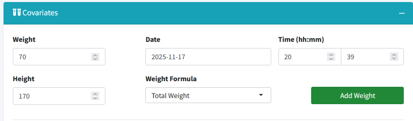
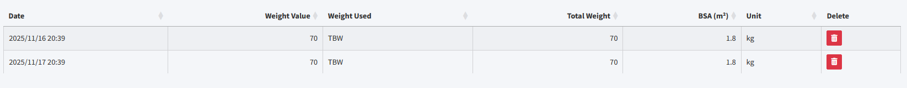
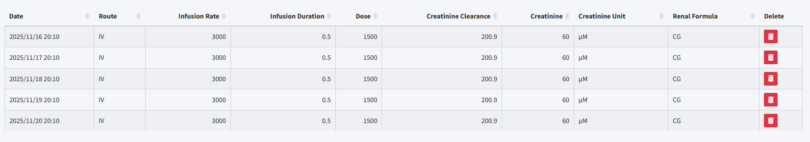
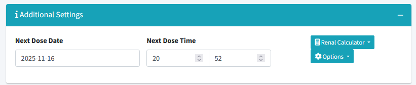
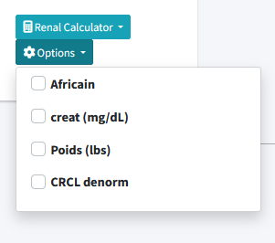

##  App functionality 

This document explains the newly added features in the PastRxUI application. 
There is 3 steps to create a file for the BestDose software :
- Provide patient informations
- Provide administration data
- Provide concentration data

#### Patient informations
This step is straightforward, the user need to provide all the necessary information in the patient info tab. 
Once this step is done, you can go to the **Administration Tab** 

> **Note** : that some drug have been pre-configured but you can still manually enter any drug name
> Same apply for Hospital name you just need to click on Add ... once entered (see image below)  
> 

### Administration Tab
You need to create a full history of weight and administration for the patient.

#### 
 ▶ Weight History 

Weight history is mandatory (at least one value is required)

To create the list of all the weight for a given patient just select the date/time, enter the weight value and unit then click on Add Weight button.
you can select a specific way to calculate weight thanks to the weight formula input (TBW, BSA or Modified weight)

This will implement the weight in the weight history table below.
If you want to edit or delete a weight entry just click on the field and manually edit the value.
You can also delete a row by clicking on the trash icon at the end of the line you want to delete.

In the table you can see the Date, time and weight value that are the only variable necessary for bestdose.
However, to help the user, the application tracks the formula used to calculate weight, the total weight, the body surface area and the weight unit (lbs or kg).

#### 
 ▶ Administration History 

Similarly to weight history you need to create a full administration history for the patient.
For this you need to first select the route of administration as this will impact the way you will enter data.

For oral or extravascular administration you need to provide Date/Time and Dose.
There is no subcutaneous administration in BestDose, if this case happen you need to use the IM route.

For IV (Non continuous) administration you need to provide Date/Time, Dose, and the Infusion duration in hours.
As seen in the image below if you decide to enter several administration at once you can use the Multiple Dose option.
This will create several administration spaced by the interval you provide in "Dose Interval (hours)" input.

For Continuous IV adminstration you need to provide more information.
The dose adminsitered will be calculated based on the beginning and the end date/time you provide.
You need to provide the electronic syringe volume (mL) and the dose of drug in the syringe (mg).
finally by providing the infusion rate (mL/h) the app will be able to calculate the dose administered over the time period.

This will create the administration history in the table below.
creatinie and weight used to calculated the creatinine clearance are the one in the covariates menu.
You can select the formula you want to use to calculate renal function by selecting it. 
Creatinine value alongside its unit and the formulat use are shown in the table.

>**Note** : Due to BestDose limitation, the weight use to calculate renal function is the weight in "Weight" input. 
> Therefore, make sure to always have the correct weight in this input adding a new administration, otherwise the renal function will be calculated with a wrong weight for Cockcroft-Gault formula.

### 
 ▶ Next dose and options 

The final menu is necessary to provide information about the next dose to be administered and some options for BestDose file creation.

 
You can change the unit used for both createinine and weight by selecting the desired unit in the options.
Similarly you can select if the patient is african american or not and if you want to denormalize the creatinine clearance.

### Concentration correction
Bestdose Cannot accept Concentration > 100. 
This app automatically rescales concentrations higher than 100 by dividing them by 10.  
However, while this behavior is always applied when saving files, the only way load the original data is to use the `.json` file created alongside the `.mb2` file.