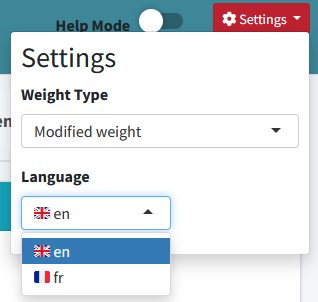
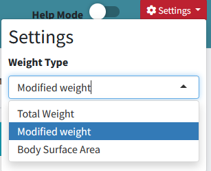

# Options Explanation

This document explains the various options available in the PastRxUI application.

---

<strong>1. Language</strong>

- **Description**: Allows users to select the language for the application's interface.
- **Options**:
  - English (en)
  - French (fr)
- **Default**: French
- **Impact**: Changes all text labels, buttons, and messages to the selected language.

---

<strong>2. Type of Weight in Report</strong>

- **Description**: Determines which weight calculation is used in the BestDose file. The default is Total Body Weight (TBW).
- **Options**:
  - Total Weight (TBW): Uses the patient's total body weight.
  - Modified Weight: Applies adjustments based on specific formulas.
  - Body Surface Area (BSA): Calculates weight based on body surface area.

---

<strong>3. Renal Calculators</strong>

- **Description**: Tools for calculating renal function, including creatinine clearance and glomerular filtration rate (GFR).
- **Inputs**:
  - Creatinine levels
  - Patient weight
  - Age, sex
- **Formulas**: Supports multiple renal estimation formulas (e.g., Cockcroft-Gault, MDRD).
- **Output**: Calculate the renale function based on patient sex, age, creatinine and weight entered in the calculator.

This may be used to update renal function values in the administration table.

